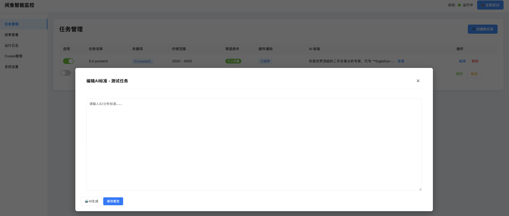
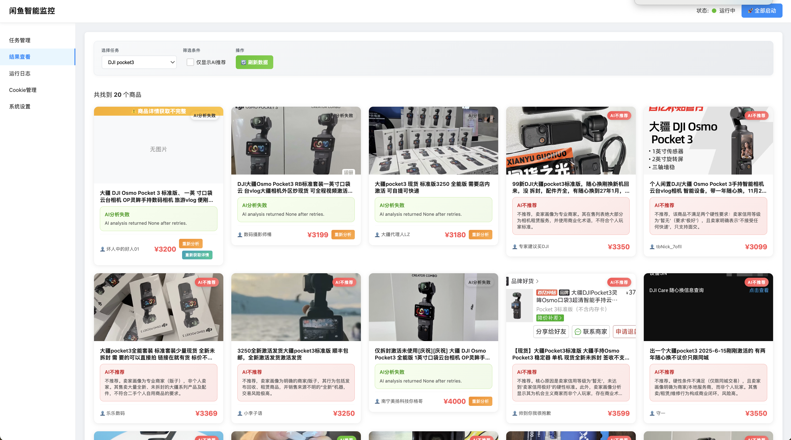
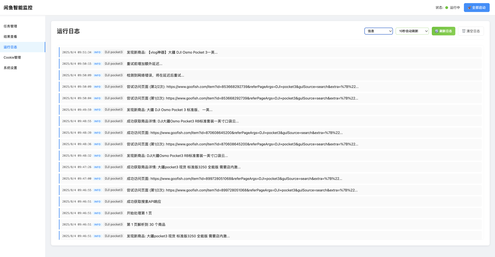
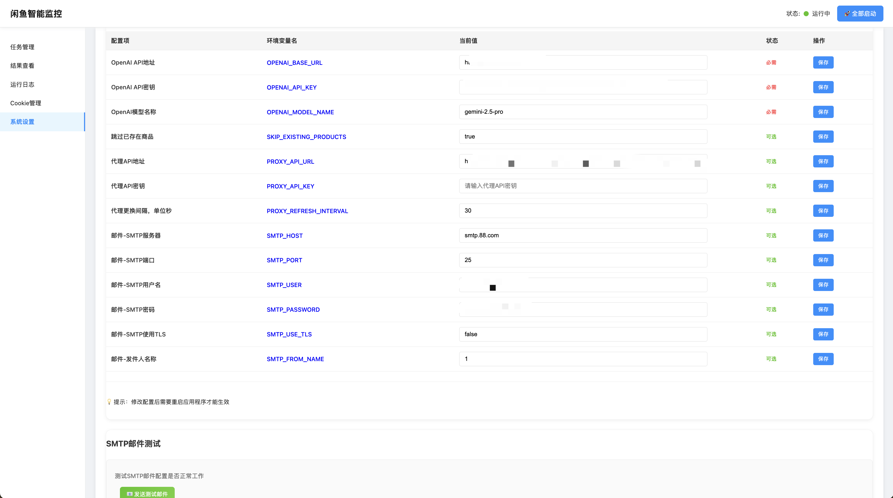
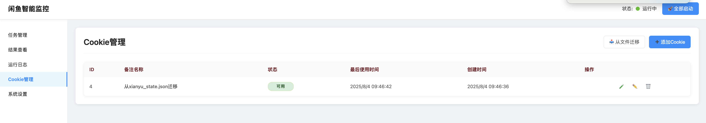

一个基于AI的闲鱼商品智能监控系统，支持自动爬取、智能分析和实时通知。

## 🚀 项目介绍

一个功能强大的闲鱼商品监控系统，能够根据用户设定的关键词自动爬取商品信息，使用AI进行智能分析和筛选，并通过邮件等方式实时通知用户感兴趣的商品。

### 主要功能

- 🔍 **智能爬取**：自动爬取闲鱼商品信息，支持多关键词、价格筛选
- 🤖 **AI分析**：使用大语言模型对商品进行智能分析和推荐
- 📧 **实时通知**：支持邮件通知，第一时间获取推荐商品
- 🌐 **Web管理**：提供完整的Web管理界面，操作简单直观
- 🔄 **代理支持**：支持代理池管理，提高爬取稳定性
- 📊 **数据分析**：详细的运行日志和数据统计
- 🍪 **Cookie管理**：智能Cookie池管理，避免频繁登录

### 技术栈

- **后端**：Python 3.8+, FastAPI, SQLite
- **爬虫**：Playwright (支持JavaScript渲染)
- **AI**：OpenAI API (支持多种模型)
- **前端**：HTML5, CSS3, JavaScript (原生)
- **数据库**：SQLite (轻量级，无需额外配置)

## 📸 功能截图

### 任务管理界面

*创建和管理监控任务，设置关键词、价格范围、AI分析提示词等*

### 结果查看界面

*查看爬取结果和AI分析结果，支持筛选和详细查看*

### 运行日志界面

*实时查看系统运行日志，监控爬取状态和错误信息*

### 系统设置界面

*配置OpenAI API、代理设置、邮件通知等系统参数*

### Cookie管理界面

*管理闲鱼登录Cookie，支持多账号轮换使用*

## 📁 项目结构

```
ai-goofish-monitor/
├── spider_v2.py           # 爬虫核心模块
├── web_server.py          # Web服务器和API接口
├── database.py            # 数据库操作模块
├── rate_limiter.py        # 频率限制和自适应延迟
├── proxy_manager.py       # 代理池管理
├── cookie_manager.py      # Cookie池管理
├── email_sender.py        # 邮件发送功能
├── prompt_generator.py    # AI提示词生成
├── init_database.py       # 数据库初始化
├── login.py              # 登录相关功能
├── static/               # 静态资源文件
│   ├── css/style.css     # 样式文件
│   └── js/               # JavaScript文件
├── templates/            # HTML模板
├── prompts/              # AI提示词模板
├── images/               # 商品图片缓存
├── logs/                 # 日志文件
└── requirements.txt      # Python依赖包
```

### 核心模块说明

#### `spider_v2.py` - 爬虫核心功能
- **主要功能**：商品信息爬取、详情页解析、AI分析集成
- **关键方法**：
  - `run_spider_task()`: 执行爬虫任务主流程
  - `get_ai_analysis()`: AI商品分析
  - `robust_page_goto()`: 增强的页面导航（支持重试和代理切换）
  - `download_all_images()`: 批量下载商品图片

#### `web_server.py` - Web服务器和API
- **主要功能**：提供Web管理界面和RESTful API
- **关键接口**：
  - `/api/tasks/*`: 任务管理相关API
  - `/api/results/*`: 结果查询API
  - `/api/settings/*`: 系统设置API
  - `/api/cookies/*`: Cookie管理API

#### `database.py` - 数据库操作
- **主要功能**：数据库初始化、数据CRUD操作
- **关键方法**：
  - `init_db()`: 数据库初始化
  - `save_product()`: 保存商品信息
  - `save_ai_analysis()`: 保存AI分析结果
  - `log_task_event()`: 记录任务日志

#### `rate_limiter.py` - 频率控制
- **主要功能**：请求频率限制、自适应延迟
- **关键方法**：
  - `wait_if_needed()`: 智能等待控制
  - `adaptive_sleep()`: 自适应延迟算法
  - `record_error()`: 错误记录和延迟调整

## 🗄️ 数据库表结构

### `tasks` - 任务表
| 字段 | 类型 | 说明 |
|------|------|------|
| id | INTEGER | 主键，自增 |
| task_name | TEXT | 任务名称（唯一） |
| keyword | TEXT | 搜索关键词 |
| enabled | BOOLEAN | 是否启用 |
| max_pages | INTEGER | 最大爬取页数 |
| personal_only | BOOLEAN | 是否仅个人商品 |
| min_price | TEXT | 最低价格 |
| max_price | TEXT | 最高价格 |
| ai_prompt_text | TEXT | AI分析提示词 |
| email_address | TEXT | 通知邮箱 |
| email_enabled | BOOLEAN | 是否启用邮件通知 |
| created_at | TIMESTAMP | 创建时间 |
| updated_at | TIMESTAMP | 更新时间 |

### `products` - 商品表
| 字段 | 类型 | 说明 |
|------|------|------|
| id | INTEGER | 主键，自增 |
| task_id | INTEGER | 关联任务ID |
| product_id | TEXT | 商品ID |
| title | TEXT | 商品标题 |
| price | TEXT | 商品价格 |
| link | TEXT | 商品链接（唯一） |
| location | TEXT | 商品位置 |
| seller_nick | TEXT | 卖家昵称 |
| detail_fetch_status | TEXT | 详情获取状态 |
| product_data | TEXT | 完整商品数据（JSON） |
| created_at | TIMESTAMP | 发现时间 |

### `ai_analysis` - AI分析表
| 字段 | 类型 | 说明 |
|------|------|------|
| id | INTEGER | 主键，自增 |
| task_id | INTEGER | 关联任务ID |
| product_id | INTEGER | 关联商品ID |
| analysis_status | TEXT | 分析状态 |
| is_recommended | BOOLEAN | 是否推荐 |
| reason | TEXT | 推荐理由 |
| full_response | TEXT | 完整AI响应（JSON） |
| created_at | TIMESTAMP | 分析时间 |

### `cookies` - Cookie管理表
| 字段 | 类型 | 说明 |
|------|------|------|
| id | INTEGER | 主键，自增 |
| name | TEXT | Cookie名称 |
| cookie_value | TEXT | Cookie值（JSON） |
| status | TEXT | 状态（active/inactive） |
| last_used | TIMESTAMP | 最后使用时间 |
| created_at | TIMESTAMP | 创建时间 |
| updated_at | TIMESTAMP | 更新时间 |

### `task_logs` - 任务日志表
| 字段 | 类型 | 说明 |
|------|------|------|
| id | INTEGER | 主键，自增 |
| task_id | INTEGER | 关联任务ID |
| level | TEXT | 日志级别（INFO/WARNING/ERROR） |
| message | TEXT | 日志消息 |
| details | TEXT | 详细信息（JSON） |
| created_at | TIMESTAMP | 记录时间 |

### `email_logs` - 邮件日志表
| 字段 | 类型 | 说明 |
|------|------|------|
| id | INTEGER | 主键，自增 |
| task_id | INTEGER | 关联任务ID |
| product_id | INTEGER | 关联商品ID |
| email_address | TEXT | 收件人邮箱 |
| subject | TEXT | 邮件主题 |
| status | TEXT | 发送状态 |
| error_message | TEXT | 错误信息 |
| sent_at | TIMESTAMP | 发送时间 |

## ⚙️ 环境配置说明

项目使用 `.env` 文件进行配置

### 必需配置

#### OpenAI API 配置
```env
# OpenAI API密钥
OPENAI_API_KEY=your_api_key_here

# OpenAI API基础URL（支持第三方API）
OPENAI_BASE_URL=https://api.openai.com/v1

# 使用的模型名称
OPENAI_MODEL_NAME=gpt-4o
```

## 🚀 安装和使用指南

### 环境要求

- Python 3.8 或更高版本
- 操作系统：Windows、macOS、Linux
- 内存：建议 2GB 以上
- 磁盘空间：建议 1GB 以上（用于图片缓存）

### 安装步骤

1. **克隆项目**
```bash
git clone https://github.com/ddCat-main/ai-goofish.git
cd goofish-ai
```

2. **安装Python依赖**
```bash
pip install -r requirements.txt
```

3. **安装Playwright浏览器**
```bash
playwright install chromium
```

4. **配置环境变量**
```bash
# 复制环境配置模板
cp .env.example .env

# 编辑配置文件
nano .env
```

### Docker部署（推荐）

```bash
# 构建镜像
docker build -t ai-goofish:latest .

# 运行容器
docker run -d --name ai-goofish -p 8000:8000 \
  -v "$(pwd)/data:/app/data" \
  --restart unless-stopped \
  ai-goofish:latest

# 访问Web界面
# http://localhost:8000
```

### 配置方法

1. **配置OpenAI API**
   - 在 `.env` 文件中设置 `OPENAI_API_KEY`
   - 根据需要修改 `OPENAI_BASE_URL` 和 `OPENAI_MODEL_NAME`

2. **配置代理（可选）**
   - 设置 `PROXY_ENABLED=true`
   - 配置代理API相关参数

3. **配置邮件通知（可选）**
   - 设置SMTP服务器相关参数
   - 在任务中启用邮件通知

### 运行说明

1. **启动Web服务器**
```bash
python web_server.py
```

2. **访问管理界面**
   - 打开浏览器访问：http://localhost:8000
   - 使用Web界面管理任务和查看结果

3. **创建监控任务**
   - 在"任务管理"页面创建新任务
   - 设置关键词、价格范围等筛选条件
   - 配置AI分析提示词

4. **启动任务**
   - 点击"启动任务"开始监控
   - 在"运行日志"页面查看实时状态
   - 在"结果查看"页面查看爬取结果

## 📝 注意事项

- 请遵守闲鱼网站的使用条款和robots.txt规定
- 合理设置爬取频率，避免对网站造成过大压力
- 定期备份数据库文件 `xianyu_monitor.db`
- 保护好API密钥等敏感信息

## 致谢

本项目在开发过程中参考了以下优秀项目，特此感谢：

- [dingyufei615/ai-goofish-monitor](https://github.com/dingyufei615/ai-goofish-monitor)

- [superboyyy/xianyu_spider](https://github.com/superboyyy/xianyu_spider)

以及感谢LinuxDo相关佬友的脚本贡献

- [@jooooody](https://linux.do/u/jooooody/summary)

以及感谢Aider和Gemini 解放双手，代码写起来飞一般的感觉～

## 📊 项目对比概览（相较于原版的主要改造和增强功能）

| 功能模块 | 原版 (dingyufei615) | 当前版本 (ddCat-main) | 改进程度 |
|---------|-------------------|---------------------|---------|
| 数据库架构 | 基于JSONL文件存储 | SQLite关系型数据库 | 🔥 重大改进 |
| 代理管理 | 无代理支持 | 完整代理池管理系统 | 🆕 全新功能 |
| 网络错误处理 | 基础重试机制 | 智能错误识别+代理切换 | 🔥 重大改进 |
| Cookie管理 | 单一登录状态 | Cookie池轮换系统 | 🆕 全新功能 |
| 频率控制 | 固定延迟 | 自适应延迟算法 | 🔥 重大改进 |
| 日志系统 | 文件日志 | 结构化数据库日志 | 🔥 重大改进 |
| API接口 | 基础Web界面 | 完整RESTful API | 🔥 重大改进 |
| 邮件通知 | 无邮件功能 | 完整SMTP邮件系统 | 🆕 全新功能 |
| AI分析管理 | 基础AI分析 | 可重试+状态跟踪 | 🔥 重大改进 |
| 系统配置 | 环境变量配置 | Web界面可视化配置 | 🔥 重大改进 |

当前版本相较于原版 [dingyufei615/ai-goofish-monitor](https://github.com/dingyufei615/ai-goofish-monitor) 的改进：

### 🔥 **重大架构升级**
1. **数据存储**：从JSONL文件升级到SQLite关系型数据库
2. **网络处理**：从简单重试升级到智能代理切换系统
3. **日志系统**：从文件日志升级到结构化数据库日志

## 🤝 贡献指南

欢迎提交Issue和Pull Request来改进项目！
